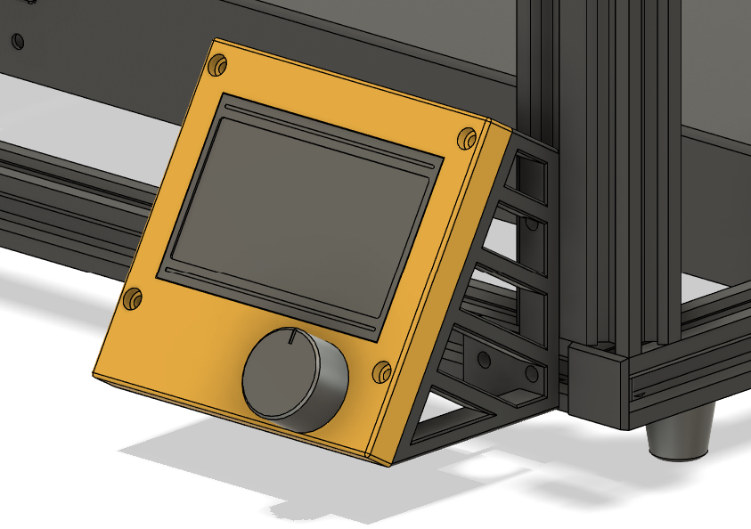

# fivebot Display Mount

**Note:** Please read [general instructions](index.html#general-instructions) before getting started

## About the mod:
* Mounts to the front of the frame (or side, in case you use your printer rotated 90 deg with the dual z mod)
* No grounding issues like the stock mount, causing sporiadic button clicks
* Looks (subjectively) nicer
* Main restriction on placement is the display cable, will look into spec for a longer one
* Will be tweaked in the future to accomodate a panel if the printer is enclosed

## Bill of materials
|Quantity|Item|Comments|
|---|---|---|
|4|M3 screws|10 and 12 mm screws will work|
|2-4|M4 screws|10 mm|
|2-4|M4 T-nuts||

## Printed parts
* [STLs directory](https://github.com/fivebot-printer/fivebot/tree/main/display/STLs)
* Print instructions in [general instructions](index.html#general-instructions)
* Any filament should work for this specific mod, ABS or ASA general recommendation

## Installation
1. Power down the printer
2. Disconnect the stock display and disassemble from the stock mount
3. Mount the left and right brackets to the frame with M4 screws and T-nuts, use the front mount for reference on spacing
4. Insert the diplay PCB into the front panel and secure to the brackets with M3 screws
5. Move the electronics enclosure if you need to for the cable to reach the display connector (leftmost) port
6. Done!
