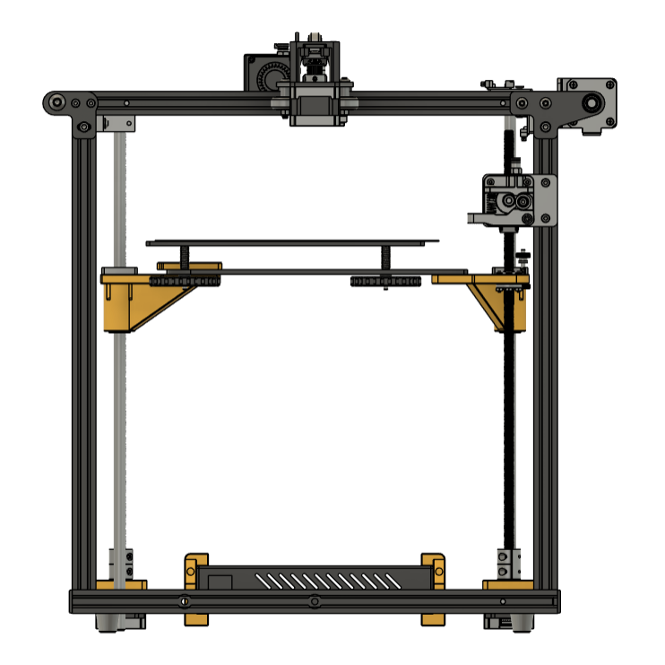

# fivebot Dual Z mod

**Note:** Please read [general instructions](index.html#general-instructions) before getting started

## Bill of materials
|Quantity|Item|Comments|
|:---:|:---:|:---:|
|1|lead screw with nut|The screw thread needs to match your current lead screw, unless you buy two new identical ones. 363 mm length stock, 400 mm should work too|
|1|stepper motor|creality 42-34 motor|
|1|lead screw coupler||
|1|stepper motor cable| For Creality steppers with middle pair of cables swapped. Single standard cable if you have a board with two Z motor connectors or a splitter cable if your board has one connector (e.g. the stock board)|
|1|Pack of M4 T-nuts| Twist-in style preferred, drop-in style works fine|
|1|Pack of M3 + M4 screws and hex nuts| Socket head screws of standard lengths (will specify specific quantities later)|

## Printed parts
* Print the parts in the [STLs directory](https://github.com/fivebot-printer/fivebot/tree/main/dual-z/STLs), quantity per naming convention `[name]_[quantity].stl`.
* Print instructions in [general instructions](index.html#general-instructions)
* The stock motor mount is included as a backup, I have not tested the two custom mounts yet but they should be better (more rigid and not protude outside the frame).

### Stepper motor brackets
The mod contains two different Z stepper motor mounting brackets. One plain, and one tweaked so that a F9-20M thrust bearing fits snugly. The bearing rests on top of the stepper motor, and the lead screw coupler rests on top of the bearing. This moves the axial downward load from the stepper shaft to the stepper housing and mounting bracket, potentially reducing Z axis banding/artifacts.

## Installation

### Move the electronics enclosure
1. Remove all of the screws securing the electronics enclosure
2. Slide the enclosure backwards and slide the mounting brackets in place
3. Secure the mounting brackets to the frame

### Install new Z assembly
1. Disassemble current Z assembly
1. Remove flange bearings from the rods and install them into front and rear bed mount. If the fit is too tight, you might need to file down the seam on the inside or calibrate your printer. Potentially use something to get more pushing force, e.g. a vice.
1. Install the lead screw nuts on the front and rear bed mounts using the stock screws (or new M3 screws). Only tighten loosely, holes are made bigger for the nut to be able to move slightly in the horizontal plane.
1. Place the bed upside down and install the front and back bed mounts with M4 screws and hex nuts
1. Mount the front guide rod top mount, centered under the top frame extrusion
1. Now to the tricky part. Slide the rods into the flange bearings and put on the bottom mounting brackets only tightening loosely
1. Mount the front guide rod to the frame and top mount, use something to support the bed during the installation. Only tighten loosely for now.
1. Rotate the rear guide rod into position and secure top frame extrusion. Again tighten loosely.
1. Now carefully measure the distance between the rod mounts and frame side extrusions, move and tighten properly when centered. Try to do this within 0.1 or 0.2 mm difference.
1. Once tightened, verify that you can move the bed all the way up and down without resistance/binding.
1. Now mount the stepper motors to the below the nuts. Again only tighten loosely
1. Install the lead screws by screwing it down through the lead screw nuts and secure in the coupler with a small space between the stepper motor shaft and screw allowing for some flex.
1. Now fine-tune the position of the steppers and lead screw nuts then tighten down. You want to lead screw to be parallel to the guide rod throughout the range of movement.
1. Install the stop screw and Z-endstop above it. Make sure the screw stick up a fair bit to prevent a potential nozzle crash on first homing
2. Connect stepper motor cable(s)
1. Installation done!

## Startup and configuration
1. Measure or use a reference object to make sure the bed mounts and base plate are level. This is extra important if used with a single Z stepper motor driver.
1. Reset the bed leveling screws so they are all at equal height roughly
1. Update firmware printer configuration
1. Start the printer
1. Test stepper movement
1. Test homing Z
1. Re-calibrate endstop setting, perform bed levelling with adjustment screws
2. Fine-tune z-offset if used and test print
