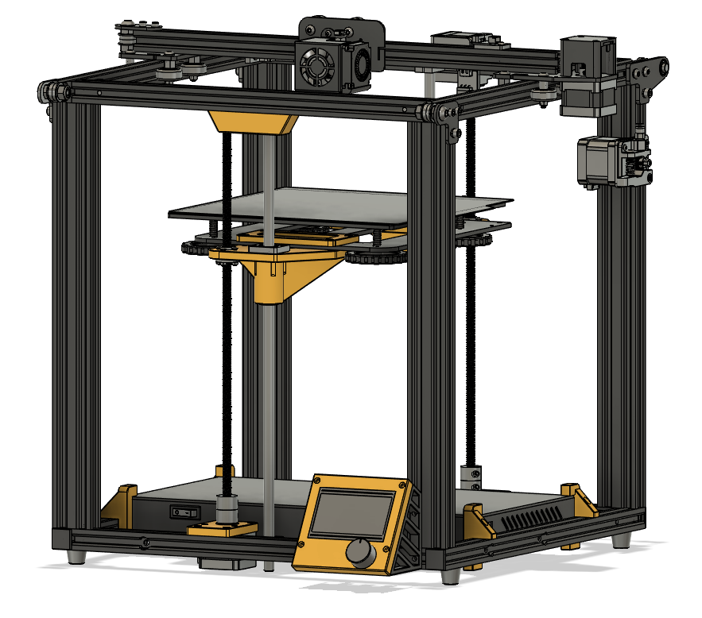

# The fivebot 3D printer

The goal of the fivebot 3D printer project is to develop a set of, ideally modular, upgrades for the Creality Ender 5 and Ender 5 Pro printers, and if possible also the Ender 5 Plus. Hopefully, making it an affordable, relatively fast, and reliable printer that can stay relevant in the rapidly developing 3D printer market. 

The intention is in no way to compete with the already existing and awesome [Zero G](https://zerog.one/) mods, but to provide a distinctly different alternative with the following goals and constraints in mind:

* Keep it as cheap/affordable as reasonable
* Use as much stock parts as possible, and add matching hardware
* No modification of the frame
* Make the printer easy to enclose
* Strive to keep it accessible for less experienced modders, minimize use of heat inserts, soldering etc or provide alternative routes
* Provided with Klipper firmware configuration primarily (contributions for other firmares welcome of course)

## Avilable mods
* [Dual Z motors](dual-z.html) (beta version)
* [Stepper motor bracket with thrust bearing](dual-z.html#stepper-motor-brackets) to potentially reduce Z-axis banding on prints (beta version)
* [Display mount](display.html) with better looks and no grounding issues

List of planned modifications, roughly in order of priority:

* Core-XY using stock roller wheels (lots of core-xy mods with rails already exist)
* Modular toolhead for the stock gantry

And future ideas and improvements:
* Dual Z motors+ sync belt for single stepper driver use
* Belt-driven dual Z with a single motor
* Touch screen mount/support
* Affordable triple-z setup with linear rods and stock bed

## General instructions

{: .warning }
**DISCLAIMER:** any modification of your 3D printer is done at your own risk and this project comes without warranties!

Read all of the instructions and notes before ripping your printer apart.

### Assembly
When assembling plastic parts, remember not to over-tighten and to come back and re-tighten if necessary (since all plastics will creep do varying degrees).

### Printed parts
Files in each mod's STLs directory, linked from each page. Required quantity per naming convention `[name]_[quantity].stl`. Any alternatives or optional parts are specified per mod.

Currently STLs are not pre-oriented for printing, use your best judgement when slicing. Orientation be provided once the designs have matured.

**Print settings:**
* Filament: ABS or ASA preferrably, if not possible then PETG, PLA not recommended unless stated otherwise (temperature and mechanical properties)
* 5 top and bottom layers @ 0.2 mm layer height
* Walls either 5 walls @ 0.4 mm line width or 4 walls @ 0.6 line width
* 40% infill (or more)
